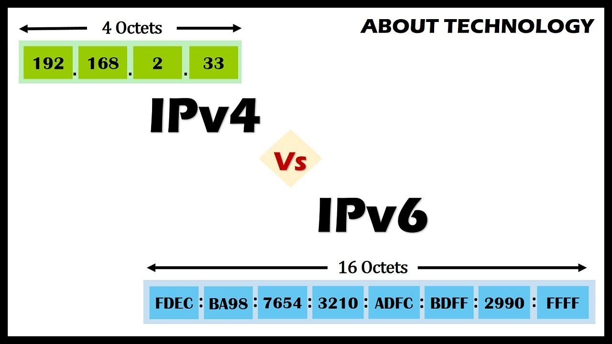
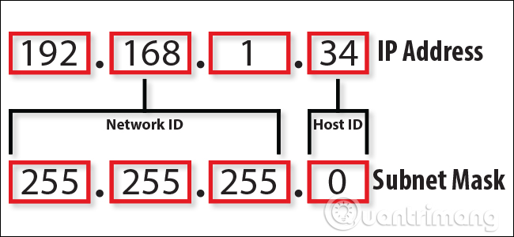
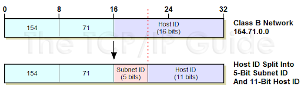
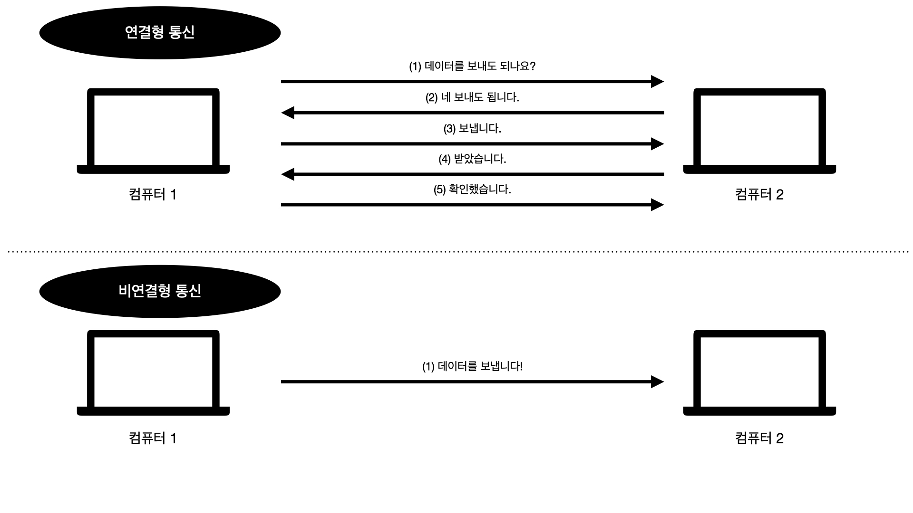
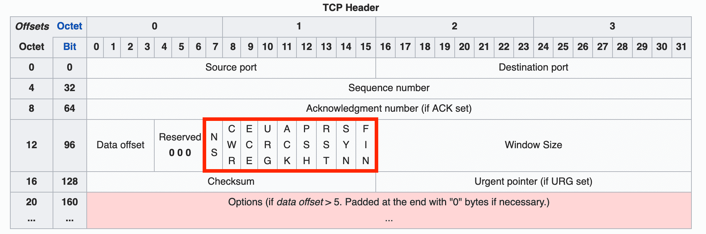
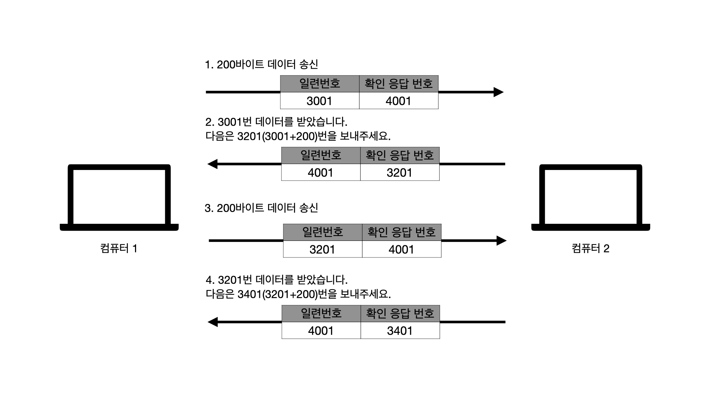
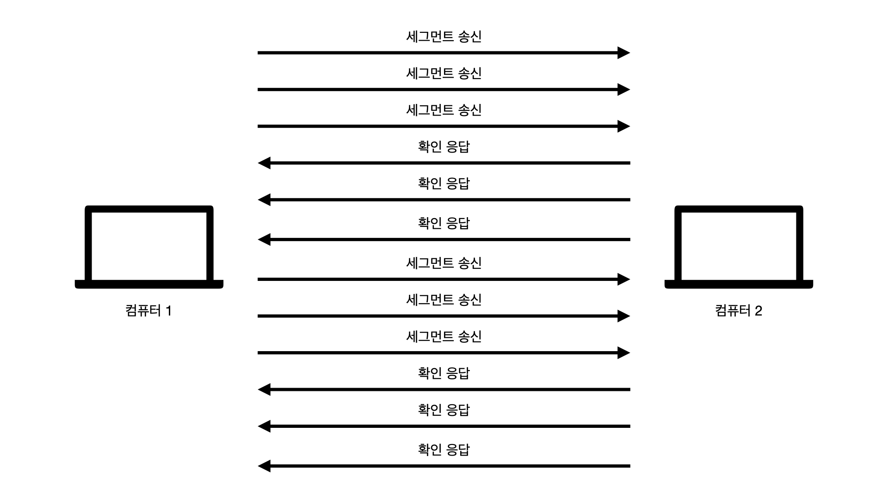

> 미즈쿠치 카츠야(2016), 「모두의 네트워크」를 읽고 요약-정리한 자료입니다.
>
> 본 글에서는 5장 네트워크 계층에 대해서 다룹니다.

# 네트워크 계층에서는 어떤 것이 일어나나요?

네트워크 간의 통신을 담당합니다. 앞서 봤던 데이터 링크 계층는 같은 네트워크 내의 전송을 담당하며,
네트워크 계층은 다른 네트워크로 데이터를 전송하는 역할을 담당합니다.
네트워크 간의 통신을 위해서는 **라우터**라는 장치를 필요로 합니다.
앞서 봤던 **스위치**를 이용해서는 같은 네트워크 내의 전송이 가능하고,
**라우터**를 통해서 네트워크 간의 전송이 가능하게 됩니다.

# 같은 네트워크 내에서 전송할 때는 MAC 주소를 사용했는데, 네트워크 간의 전송에서는 어떤 주소를 사용하나요?

네트워크 간의 전송에서는 **IP 주소**를 사용합니다. 라우터는 스위치가 MAC 주소 테이블을 관리하듯이 **라우팅 테이블**이
존재해서 IP 간의 경로 정보를 등록하고, 관리합니다.

네트워크 계층에서 캡슐화할 때 **IP 헤더**를 붙입니다. IP 헤더에는
1. 버전(version)
2. 헤더 길이(header length)
3. 서비스 유형(service type)
4. 전체 패킷 길이(total length)
5. ID(identification)
6. 조각 상태(flags)
7. 조각의 위치(fragment offset)
8. TTL,
9. 프로토콜(protocol)
10. 헤더 페크섭(header checksum)
11. **출발지 IP 주소**
12. **목적지 IP 주소**

로 구성이 됩니다. 네트워크 계층에서 IP 헤더가 추가된 데이터를 **IP 패킷**이라고 합니다.

IP 주소는 인터넷 서비스 제공자(ISP)에게 제공받으며, IP 버전의 종류는 **IPv4**와 **IPv6**이 있습니다.

IPv4는 현재 주로 사용하고 있는 IP 주소로 32비트로 되어 있어 약 *43억개*의 주소를 만들 수 있습니다. 인터넷이
널리 보급되면서 IP 주소가 부족한 상황이 왔고, IPv6는 128비트로 되어 있어 IPv4보다 훨씬 더 많은 주소를 만들 수 있습니다.
(약 340간(3.4 * 10^38) 개)

IP 주소는 *공인 IP 주소*와 *사설 IP 주소*가 존재합니다. 현재 IPv4의 주소가 부족한 상황이라 라우터에는 유일한
공인 IP 주소를 배정하고 네트워크 내부의 컴퓨터들에게는 사설 IP 주소를 배정합니다. 라우터의 **DHCP** 기능을 사용되면
사설 IP 주소를 자동으로 할당할 수 있습니다. 해당 방법을 통해서 IP 주소를 절약할 수 있습니다.

IP 주소를 편하게 부르기 위해, 8비트 단위로 나누어 표기하는데 8비트를 *옥텟*이라고도 부릅니다.
IPv4의 경우에는 각각의 옥텟을 10진수로 바꾸어 표시합니다.

또 IP 주소의 구성을 보면 *네트워크 ID*와 *호스트 ID*로 나누어서 구성되어 있습니다.
네트워크 ID의 경우는 해당 네트워크의 ID 값을 표현하고, 호스트 ID는 네트워크 내에서의 다른 네트워크 기기를 표시합니다.
IP 주소(IPv4)의 32비트 중 네트워크 ID 비트의 크기에 따라 담을 수 있는 기기의 개수가 달라집니다.

IP 주소의 클래스라는 개념으로 네트워크 크기를 구분하게 됩니다.

| 클래스 이름 	| 내용                       	|
|-------------	|----------------------------	|
| A 클래스    	| 대규모 네트워크 주소       	|
| B 클래스    	| 중형 네트워크 주소         	|
| C 클래스    	| 소규모 네트워크 주소       	|
| D 클래스    	| 멀티캐스트(multicast) 주소 	|
| E 클래스    	| 연구 및 특수용도 주소      	|

A 클래스는 처음 8비트가 네트워크 ID고 나머지 24비트가 호스트 ID, 
B 클래스는 처음 16비트가 네트워크 ID고 나머지 16비트가 호스트 ID, 
C 클래스는 처음 24비트가 네트워크 ID고 나머지 8비트가 호스트 ID가 됩니다.

아래는 C클래스 네트워크의 예시입니다.

호스트 ID의 비트를 모두 0으로 만든 것을 **네트워크 주소**라고 부르며, 해당 네트워크를 지칭하는데 사용됩니다.
(위 그림의 예시에서는 192.168.1.0에 해당) 
호스트 ID의 비트를 모두 1로 만든 것을 **브로드캐스트 주소**라고 부르며, 해당 네트워크에 있는 모든 컴퓨터에 데이터를 전송하고 싶을 때
사용합니다.(위 그림의 예시에서는 192.168.1.255에 해당)

# 네트워크 안에서 또 그룹을 나눌 수가 있나요?

네트워크를 또 다시 작은 네트워크로 분할하는 것을 **서브넷팅(subneting)**이라 합니다.
그렇게 되면 IP 주소는 네트워크 ID, 서브넷 ID, 호스트 ID로 나누어지며, 서브넷 ID를 통해 네트워크 내에 추가적인 그룹을 만듭니다.
아래는 B클래스의 네트워크를 5비트만큼 서브넷팅한 예시입니다.

IP 주소에서 어느 비트만큼 네트워크를 뜻하는지를 알기 위해서 **서브넷 마스크**를 사용합니다.
서브넷 마스크란 네트워크 ID와 서브넷 ID에 해당 하는 비트를 1로 넣은 IP 주소이며 위의 그림의
경우에는 11111111 11111111 11111000 00000000(255.255.248.0)에 해당합니다.
**프리픽스(prefix) 표기법**을 사용하기도 하는데, 서브넷 마스크를 **/비트 수**로
표시한 것을 뜻합니다. 위의 예시에서는 /21로 표시할 수 있습니다.

# 전송 계층은 어떤 역할을 하나요?

전송 계층에서는 데이터 전송이 제대로 전송되었는지 검증하는 역할을 합니다. 전송 계층 내에는
오류를 점검하는 기능이 있어 오류가 발생하면 데이터를 재전송하도록 요청합니다.

또한 해당 데이터가 어떤 애플리케이션에 사용되는지 **포트**를 통해서 식별하는 역할도 합니다.

# 포트는 무엇인가요?

포트 번호는 건물에서 호수 같은 역할을 하며 데이터가 올바른 애플리케이션에 도달하도록 합니다.
포트 번호는 0~65545번까지 사용할 수 있으며 **0 ~ 1023번 포트**는 주요 프로토콜이 사용
하도록 예약이 되어 있으며 이러한 포트를 **웰노운 포트(well-known port)**라고 합니다.

| App 	| port number 	|
|:-----------:	|:-----------:	|
|     SSH     	|      22     	|
|     SMTP    	|      25     	|
|     DNS     	|      80     	|
|     HTTP    	|     110     	|
|     POP3    	|     110     	|
|    HTTPS    	|     443     	|

# 전송 계층에서는 어떻게 데이터가 잘 전송되었는지 검증하나요?

정확하게 말하자면 전송 계층에는 두 가지 전송 방법이 존재합니다. 첫번째는 데이터가 전송되고
도착하는 것을 신뢰할 수 있고 정확한 데이터를 전달하는 통신인 **연결형 통신**이고,
나머지 하나는 검증을 최소화하고 효율적으로 데이터를 전달하는 **비연결형 통신**입니다.

컴퓨터 1에서 컴퓨터 2로 데이터를 전달한다고 했을 때, 아래와 같은 과정으로 전달하게 됩니다.

연결형 통신은 연결이 제대로 됐는지 몇 번씩이나 확인하고, 비연결형 통신은 연결이 됐는지 확인 없이
바로 데이터를 전송하게 됩니다.

연결형 통신 프로토콜에는 **TCP**가 사용되고, 비연결형 통신 프로토콜에는 **UDP**가 사용됩니다.

# TCP는 어떻게 동작하나요?

TCP가 어떻게 동작하는지 알기 위해서는 전송 계층에서 캡슐화가 어떻게 이뤄지는지를 알아야 합니다.
전송 계층에서는 **TCP 헤더**가 붙고 TCP 헤더가 붙언 데이터를 **세그먼트**라고 합니다.
TCP 헤더에는

1. 출발지 포트 번호(16비트)
2. 목적지 포트 번호(16비트)
3. 일련번호(32비트)
4. 확인 응답 번호(32비트)
5, 헤더 길이(4비트)
6. 예약 영역(6비트)
7. 코드 비트(6비트)
8. 윈도우 크기(16비트)
9. 체크섬(16비트)
10. 긴급 포인터(16비트)
11. 옵션

으로 구성되게 됩니다.

위의 연결형 통신에서 상대 컴퓨터가 연결 받을 수 있는 상태인지를 알 수 있게 연결을 확립하는
과정을 거치게 되는데 이를 **3-way 핸드셰이크**라 합니다.

**7번 코드 비트**를 이용해서 3-way 핸드셰이크를 구성하게 됩니다.

코드 비트는 위와 같은 특정 정보를 나타내는 비트인 *Flag*들로 구성되게 되는데,
이 중 연결 요청을 하는 SYN, 확인 응답을 하는 ACK, 연결을 끝내는 FIN이 3-way
핸드셰이크에서 많은 역할을 담당합니다.

데이터를 보내는 컴퓨터가 먼저 TCP 헤더에 SYN flag에 1비트를 표시해서 보내면,
데이터를 받는 컴퓨터가 연결 요청을 받았다는 의미로 SYN과 ACK에 1비트를 표시한 뒤 보냅니다.
데이터를 보내는 컴퓨터가 해당 헤더를 받은 뒤 확인했다는 의미로 ACK에 1비트를 표시한 뒤
다시 보내는 것으로 Handshake를 마무리하고, 두 컴퓨터는 통신할 준비가 된 것을 확인합니다.

# TCP 헤더에서 확인 응답 번호와 일련 번호는 어떤 역할을 하나요?

앞서 큰 용량의 데이터의 경우에는 패킷 단위로 나누어서 전달하는 것을 배웠습니다.
3-way handshake를 통해서 연결이 확립되고 난 뒤에는 *일련 번호(sequence number)*와
*확인 응답 번호(acknowledgement number)*를 통해서 데이터가 제대로 전달되는 것을
확인하면서 데이터를 교환합니다.

일련번호와 확인 응답 번호를 사용해서 데이터가 제대로 전송됐는지를 확인할 수 있고,
제대로 전송되지 못한 것이 확인된 경우에는 재전송하도록 되어 있습니다.
이것을 **재전송 제어**라고 합니다.

위의 통신처럼 데이터를 하나 보낼 때마다 다음과 같은 통신을 반복하게 되면 한 번 보낼때마다
한 번씩 응답을 모두 받아야되기 때문에 효율이 좋지 않습니다.
그래서 한 번 보내고 확인 응답을 보내는 대신 일정 횟수만큼 데이터를 보내놓고, 한번에
확인 응답을 받으면 효율이 높아집니다. 상대방의 세그먼트(데이터)를 받고 임시로 저장할 수 있는
**버퍼(buffer)**가 있기 때문에, 응답을 바로 받지 않고 한번에 일정 갯수의 데이터를
보내도 데이터가 유실되지 않습니다. 3-way handshaking을 진행할 때 버퍼 사이즈를
TCP 헤더 내의 8. 윈도우 크기를 전달해서 상대방 컴퓨터의 버퍼사이즈를 알고, 한번에 보낼 수
있는 데이터 사이즈를 알 수 있습니다. 윈도우 크기 이상으로 데이터가 버퍼에 쌓이게 되면
그 이상의 데이터는 저장하지 못합니다. 이를 **오버플로**라고 합니다.

윈도우 크기를 알고 있는 상태에서는 아래 그림과 같이 일정 횟수의 세그먼트를 송신하고,
그에 대한 응답을 기다리는 식으로 송신이 이루어지게 됩니다.

# UDP의 경우에는 어떻게 송신이 이뤄지게 되나요?

데이터 전송이 제대로 전송되는 것을 보장하기 위해서 확인 과정을 많이 거치는 TCP 대신
UDP의 경우에는 빠른 파일 전송을 위해 확인 응답을 확인하는 작업을 거치지 않고 데이터를
송신합니다. 동영상 서비스와 같이 빠른 파일 전송을 필요로 하는 곳에 사용되게 됩니다.

UDP를 사용한 통신에는 **UDP 헤더**가 붙게 되는데 UDP 헤더가 붙은 데이터를 **UDP 데이터그램**이라고 합니다.

UDP 헤더에는

1. 출발지 포트 번호(16비트)
2. 목적지 포트 번호(16비트)
3. 길이(16비트)
4. 체크섬(16비트)

이 붙습니다.

UDP를 사용하면 랜에 있는 컴퓨터나 네트워크 장비에 데이터를 일괄로 보낼 수 있는데,
이를 **브로드캐스트(broadcast)**라고 합니다. TCP의 경우에는 데이터를 전송할 때
3-way 핸드셰이크를 통해 확인하는 작업을 일일히 거쳐야하기 때문에 브로드캐스트에는
적합합지 않습니다.

# 요약

**네트워크 계층**에서는 네트워크 간의 데이터 전송을 담당합니다. 출발지의 IP 주소와
도착지의 IP 주소를 등록해서 전송이 이루어집니다. 네트워크 계층의 통신은 **라우터**를
이용해서 이뤄지며 라우터를 이용해서 다른 네트워크의 컴퓨터에 데이터를 보내거나 네트워크를
분리할 수 있습니다.

**전송 계층**에서는 데이터가 제대로 전송되는지 확인하고 올바른 어플리케이션에 데이터를
전달하는 역할을 합니다. 전송 계층에는 **TCP** 프로토콜을 사용하는 **연결형 통신** 방법과
**UDP** 프로토콜을 사용하는 **비연결형 통신** 방법이 있습니다. 연결형 통신은 연결을 시작하는
과정, 데이터를 전송하는 과정, 연결을 끝는 과정을 모두 확인 응답을 받으며 데이터가 제대로
전송되었는지를 확인하고, UDP는 데이터를 전송하는 과정에서 별도의 확인 과정을 거치지 않습니다.
전송 계층에서는 포트 번호를 통해서 어느 어플리케이션에 전달되는 데이터인지를 확인하고 해당
데이터를 해당 어플리케이션에 전달하게 되는데, **0~1023번 포트**는 **웰노운 포트**로
각각의 번호마다 어떤 어플리케이션에 해당하는지가 정해져있습니다.

다음 글에서는 어플리케이션이 동작하는 응용 계층과 네트워크의 전체 흐름이 어떻게 되는지를
살펴볼 예정입니다.

읽어주셔서 감사합니다. :)
