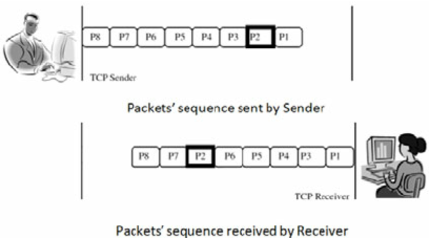

> 미즈쿠치 카츠야(2016), 「모두의 네트워크」를 읽고 요약-정리한 자료입니다.
>
> 본 글에서는 1장 네트워크 첫걸음, 2장 네트워크의 기본 규칙에 대해서 다룹니다.

# 네트워크 도대체 뭔가요?

Oxford Languages 사전에서 네트워크는 사람이나 물체가 서로 연결되어 있는 그룹이나 시스템(a group or system of interconnected
people or things)를 뜻합니다. 우리가 쓰는 네트워크는 사실 컴퓨터 네트워크를 지칭하는데요. 즉, 컴퓨터들이 서로 연결되어 있는 시스템를 뜻합니다.

# 왜 컴퓨터 네트워크가 필요한가요?

너무 당연해졌지만 컴퓨터 간의 정보, 데이터를 전송하기 위해서 사용합니다. 우리가 옆집 친구와 메일을 주고 받는 것도, 저 먼 나라의 웹사이트를 볼 수 있는 것도
다 네트워크 때문에 가능한 것입니다.

Q. 그러면 저기 먼 나라에 있는 컴퓨터들과도 연결되어 있나요?

A. 네 맞습니다 :) 해저케이블을 통해서 바다 건너 국가와도 연결되어 있어 통신이 가능합니다.

# 네트워크를 통해서 어떻게 데이터가 전송되나요?

이건 조금 큰 질문이라, 각각의 단계를 하나하나 나눠서 살펴볼 예정입니다. 우선 이미지나 영상 같은 사이즈가 큰 데이터를 전송할 때는
**패킷(packet)**으로 나누어 전송합니다. 큰 데이터를 그대로 보내게 되면 한 데이터가 네트워크의 대역폭을 너무 많이 차지해서 다른 데이터의 흐름을 막을 수 있습니다.
이는 1차선 도로에서 덤프 트럭 같은 큰 차가 제대로 나가지 못할 때 그 뒤에 있는 차들까지 가지 못하고 정체되는 상황을 생각하면 될 것 같습니다. 그렇기 때문에
네트워크를 통해 전송되는 데이터의 경우 **패킷** 단위로 나누어 전송되게 됩니다. 또한 아래 그림처럼 나누어진 패킷이 원래의 순서대로 받는 사람에게
전달되는 것이 아니기 때문에, 각 패킷에 원래의 순서를 작성하여 보낸 뒤 받는 쪽에서 모든 패킷을 받고 난 뒤 재조합하는 과정을 거치게 됩니다.

# 그럼 데이터의 사이즈는 어떻게 판단하나요?

컴퓨터는 0과 1만으로 모든 것을 표현합니다! 요런 말들 많이 들어보셨죠? 0과 1만을 나타내는 이진수로 데이터의 상태를 표시하기 때문에 0과 1을 나타내는 정보
하나가 최소 단위인 **비트(bit)**가 됩니다. 근데 비트는 너무 작은 단위이기 때문에 기본 데이터 단위로는 비트가 8개 모인 **바이트(byte)**가 사용됩니다.

이게 우리가 흔히 아는 단위인 KB(kilobyte)는 byte가 1000개, MB(megabyte)는 byte가 10^6개, GB(gigabyte)는 byte가 10^9개 모인 단위입니다.

# 네트워크는 어떻게 구분하나요?

좁은 범위의 네트워크인 **랜(LAN, Local Area Network)**과 넓은 범위의 네트워크인 **왠(WAN, Wide Area Network)**으로 나뉘어집니다.
보통 사무실이나 가정같은 제한된 공간에서 연결된 네트워크를 랜이라 하고, KT나 SK텔레콤같은 ISP(인터넷 서비스 제공사업자)들을 이용해서 LAN과 LAN끼리
연결된 네트워크를 뢘이라 합니다.

랜이나 왠은 속도 차이가 납니다. 랜은 좁은 범위에 걸쳐있기 때문에 속도가 빠르고 오류가 적습니다. 왠은 반대로 넓은 범위에 위치하고 있기 때문에 속도가
느리고 오류가 많습니다.

# 네트워크를 통해 통신할 때 주의해야하는 점이 있나요?

사용하는 언어가 다른 두 사람이 만나서 대화할 때 의사소통이 불가능하듯이, 제대로 통신을 하기 위해서 공용의 규칙을 필요로 하게 됩니다.
이러한 규칙을 **프로토콜(Protocol)**이라고 말합니다. 이러한 프로토콜에 맡게 데이터를 포장해서 보내고, 받는 쪽에서도 이러한 프로토콜에 맡게
포장을 뜯고 내용물을 확인합니다. 이를 통해서 혼선 없이 데이터를 전송할 수 있게 됩니다. ISO라는 국제표준화기구(kg, m를 기본 단위로 정한 곳)에서
**OSI 모델**이라는 표준 규격을 제정했습니다. 앞으로 네트워크를 설명하는데 중심이 되는 개념이니 잘 익혀두면 좋습니다.

네트워크에서 데이터를 전송하기 위해서 하는 일을 총 7개의 계층으로 나누었습니다. 각각의 계층을 **레이어(Layer)**라고도 부릅니다.
TCP/IP 모델은 이를 좀더 간소화한 모델로 총 7개의 계층을 4개의 계층으로 다시 나누어서 정리합니다.
물리계층, 데이터링크계층을 네트워크 인터페이스 계층으로 세션 계층, 표현 계층, 응용 계층을 그대로 응용 계층으로 합쳐서 표현했습니다.
각각의 계층은 데이터를 해석하는 별도의 **프로토콜**이 존재합니다. 그를 이용해서 데이터를 포장하고, 받는 쪽에서는 그 포장을 푸는데요.
이를 **캡슐화(encapsulation)**, **역캡슐화(decapsulation)**이라고 합니다.

우선 응용 계층에서 보내고자하는 데이터가 만들어집니다. 전송 계층에서 신뢰할 수 있는 통신이 이뤄질 수 있도록 하는 정보를 **헤더(Header)**에 담아
데이터에 붙입니다. 네트워크 계층에서는 다른 네트워크와 통신하기 위해 받는 사람의 정보 등을 포함한 헤더를 붙입니다.
데이터 링크 계층에서는 물리적인 통신 채널을 연결할 수 있게 하기 위해 헤더와 **트레일러(trailer)**를 붙입니다. 트레일러는 데이터 끝에 붙는 정보를 의미
합니다. 최종적으로 나갈 때 헤더 3개와 트레일러 1개가 추가되어 나가게 되는데, 이것을 캡슐화라고 합니다.
그리고 받는 쪽에서는 계층마다 붙였던 헤더와 트레일러를 제거하면서 데이터를 수신하게 됩니다.

이번 글에는 네트워크가 무엇인지, 네트워크를 통해 데이터 전송이 어떻게 이뤄지는지 간략하게 살펴봤습니다.
다음 글에는 각각의 계층에서 어떻게 캡슐화가 이뤄지는지를 살펴볼 예정입니다. :)
