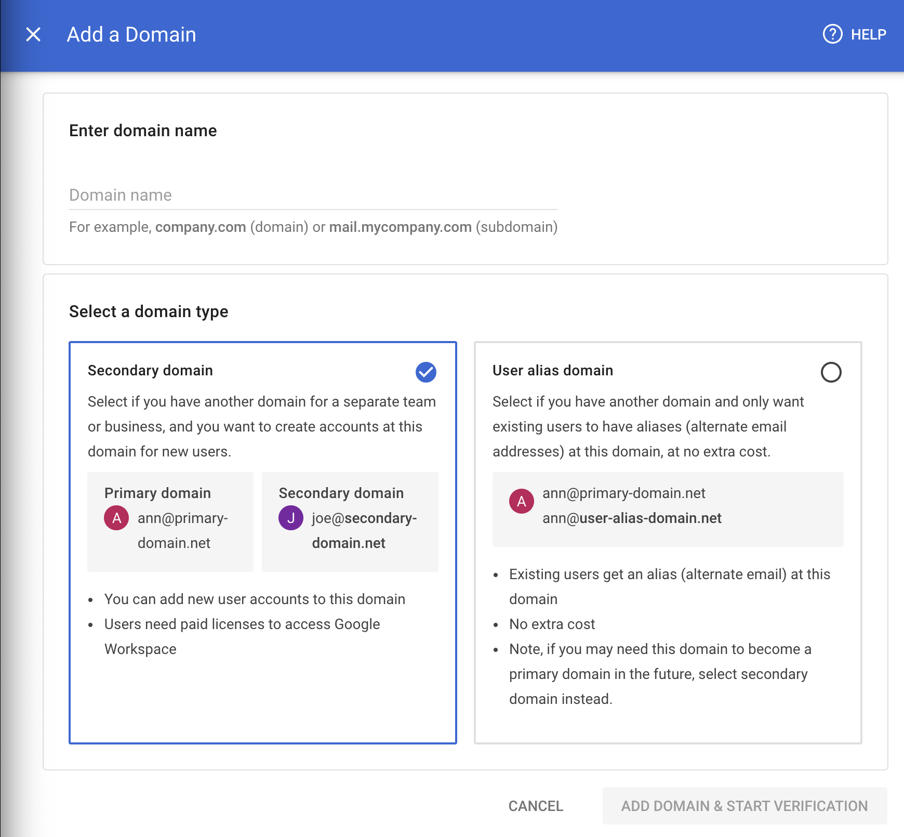
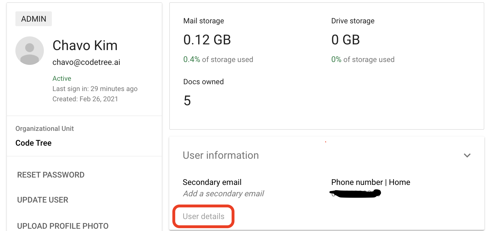

> 주의) 서비스 이름을 변경 중이라 어떤 절차가 필요하신지 궁금해서 오신 분들은 다시 한번 서비스 이름을 변경해야하는지 생각해보세요.
>
> 새로 서비스를 시작하는 분이라면 왠만하면 서비스 이름을 바꾸지 않는 것을 추천드립니다.

회사를 법인으로 전환하면서 기존에 있었던 `리브로스코드`라는 서비스명에서 `코드트리`로 전환하게 되었습니다.

처음에 서비스 명을 바꾼다고 했을 때 사이트 도메인이나 홈페이지에 있는 텍스트정도만 바꾸면 될줄 알았는데,
저희가 쓰고 있었던 `Google Workspace`, `Github`, `Slack`, `AWS EC2, S3`, `MYSQL`, `Google Drive`를
모두 새로운 서비스명 + 새로운 계정으로 옮겨줘야하는 문제가 있었습니다.

서비스 이름을 변경하는 과정에서 정보가 유실되지 않을까 하는 스트레스도 많이 받았는데,
관련 경험을 공유한 포스트가 존재하지 않았습니다.
그래서 다음에 서비스 이름을 변경하는 분에게 도움을 드리기 위해 이 글을 작성하게 되었습니다.

~~하지만 왠만하면 서비스 이름 변경하지 마세요 제발...~~

서비스가 커지면 더 커질수록 쉽지 않을 것 같습니다.
*(최근에 `에듀캐스트`가 `홀릭스`라는 이름으로 아예 바뀐 것 같은데 이 분들은 어떻게 처리하셨을지 궁금하네요.)*

이제 각설하고 제품별로 어떻게 새로운 서비스 명으로 변경했는지 아래에 적어보겠습니다.

## Google Workspace

### 도메인 바꾸기

서비스 이름을 바꿀 때 `Google Workspace`에서 도메인을 바꾸어줘야 합니다.

Admin Console을 들어가서 `Domains > Add a Domain`을 클릭하면 새로운 도메인을 추가하는 것이 가능합니다.



***Secondary domain***과 ***User alias domain*** 선택지로 나뉘어지는데,
***Secondary domain***으로 추가해주셔야 합니다.

이후 주 도메인*(primary domain)*으로 사용하고자 한다면,
*Secondary domain*으로 추가해주셔야 합니다.

성공적으로 도메인 등록을 마치고 나면 `Users`에 들어가서 각 유저의 항목에
`Update user`를 클릭하여 이메일의 도메인을 바꾸어 줄 수 있습니다.

### 기존의 도메인은?

기존의 도메인을 어떻게 처리하는가가 관건일 것 같은데요. 저희는 기존의 이메일에 답장을 하는 경우나,
예전 이메일 주소를 알고 있어서 기존 도메인으로도 계속 메일이 올 것이라 생각했습니다.

그래서 아까봤던 ***User alias domain***을 이용하여 하나의 아이디에 두개의 도메인을 사용했습니다.

그렇게 하면 `chavo@codetree.ai`나 `chavo@leebroscode.com`로 보낸 메일 모두 `chavo@codetree.ai`로 오게 됩니다.

이때, 새로 등록한 도메인을 *Primary domain*으로 등록하게 되면 기존의 도메인은 *Secondary domain*으로
바뀌게 되는데요. 이를 *User alias domain*으로 변경해줘야 합니다.

이 과정에서 분명히 모든 유저에게 새로운 도메인으로 email 도메인을 변경했음에도 불구하고, 기존의 도메인에 *유저가 남아있으니
불가능하다는 오류 메세지*가 나타났습니다.*(Domain has remain users)*

Google Workspace Support Team에 문의하고나서야 무엇이 잘못됐는지 깨달았습니다.

`Update User`에서 email 도메인을 변경하게 되면 기존의 도메인은 `Alternate email`로 들어가게 됩니다.



`Alternate email`은 `Users > User infomation > User details`를 눌러야 확인할 수 있기 때문에,
*Support Team*에게 전해듣기 전까지는 확인할 수 없었습니다.😭

사실 이렇게 해도 본래의 목적인 기존 도메인으로 보내도 기존 도메인을 쓰고 있었던 유저는 메일을 전해받을 수 있기 때문에
유지해도 상관 없지만, 이후에는 기존 도메인을 삭제할 수도 있을 것이라 생각해서 `Alternate email`을 모두 삭제하고
기존 도메인을 *User alias domain*으로 변경했습니다.

## Github

기본적으로 `github`은 ***username***과 ***Primary email address***를 바꾸는 기능을 제공합니다.

* [primary email address 바꾸기](https://docs.github.com/en/account-and-profile/setting-up-and-managing-your-github-user-account/managing-email-preferences/changing-your-primary-email-address)
* [username 바꾸기](https://docs.github.com/en/account-and-profile/setting-up-and-managing-your-github-user-account/managing-user-account-settings/changing-your-github-username)

위의 두개로 계정을 바꾸는 것을 추천드립니다. 하지만 만약 개인 계정으로 연결되어 있고 이를 회사 계정으로 아예 이관하고 싶다면..?

이 경우 또한 `Repository transfer`를 통해서 리포지토리의 소유권을 바꾸는 것이 가능합니다.
* [repository 소유권 이전하기](https://docs.github.com/en/repositories/creating-and-managing-repositories/transferring-a-repository)

모든 제품에서 github을 옮기는 과정이 제일 쉬웠습니다.☺️


<p style="text-align: center;">
    <em>(github...당신은 그저 빛...)</em>
</p>

## Slack

`Slack` 또한 `Workspace`의 이름과 URL을 바꾸는 기능을 제공합니다.

* [Slack 워크스페이스 이름 또는 URL 변경](https://slack.com/help/articles/201663443-Change-your-workspace-or-org-name-and-URL)

## AWS

AWS 계정의 이메일을 바꾸는 것 또한 가능합니다!
*~~(저는 이걸 모르고 새로운 계정을 만들었다가 다시 삭제하는 바보짓을 했습니다.)~~*

`Github`과 유사하게 계정의 이름, 이메일 주소를 바꾸는 것이 가능합니다.

* [AWS 계정 이름, 이메일 주소 변경하기](https://docs.aws.amazon.com/awsaccountbilling/latest/aboutv2/manage-account-payment.html#manage-account-payment-edit-user-name)

## AWS EC2

다행히 저희는 instance 이름을 서비스 이름으로 설정하지 않아 재설정하지 않았지만,
AWS는 이러한 기능을 [Command Line Interface](https://aws.amazon.com/cli/)로 제공합니다.

```
aws ec2 create-tags --resources i-xxx --tag "Key=Name,Value=PROD-DEL-xxx"
```

위 Command로 EC2 Instance 이름을 수정해줄 수 있습니다.
[출처](https://stackoverflow.com/questions/35772757/how-to-rename-ec2-instance-name)

## AWS S3

S3 bucket 이름 또한 `AWS CLI`를 이용해서 변경해주어야 합니다.

```
aws s3 mv s3://old-bucket s3://new-bucket --recursive
```

위 Command로 수정해줄 수 있습니다. old-bucket에는 기존의 bucket 이름,
new-bucket에는 변경을 원하는 bucket의 이름을 적어주면 됩니다.

## MYSQL

현재 저희는 `AWS RDS`에서 `MYSQL`로 DB 관리를 해주고 있습니다.

DB 이름에도 서비스명이 들어가있어서, 전체 DB를 dump한 이후 새로운 서비스 이름이 적혀있는 DB로
옮겨주었습니다.

```
mysqldump -u [username] -p -h [host] --set-gtid-purged=OFF [old db name] > temp.sql
mysql -u [username] -p -h [host] --one-database [new db name] < temp.sql
```

## Google Drive

개인 Google 계정에 Drive를 사용하고 있었기 때문에 이를 회사 Workspace Drive로 옮겨야 했습니다.

참고로 같은 Workspace 내에서는 Drive에 있는 파일의 소유권을 변경하는 것이 가능합니다.

* [Google Drive에서 file 소유권 변경하기](https://support.google.com/drive/answer/2494892)

그게 녹록치 않은 경우는 구글 드라이브의 기능을 이용해서 전체 드라이브 파일을 메일로 받은 이후 옮겨주는 방법도 가능합니다.

* [Google Drive 전체 파일 메일으로 export하기](https://dailymalay.tistory.com/72)

하지만 이게 속도가 어마어마하게 느리기 때문에, Google Drive에서 제공하는 Desktop Program을 사용하면 좀더 빠르게 옮길 수 있습니다.

* [Google Drive Desktop Program](https://www.google.com/drive/download/)

## 마치며

정리해보니 그렇게 많지는 않네요. 이렇게 정리된 정보가 있었다면 어렵지 않았을텐데, 혼자 뻘짓한 것들이 많아서...
여러분들은 도움이 되었으면 좋겠습니다.🙌

1. 대부분의 제품에서 소유권 변경이나 이메일 변경이 가능하다. 이 옵션을 제일 먼저 찾아보자.
2. 그게 안된다면 CLI를 활용하는 식으로 다른 옵션이 존재한다. 그걸 꼭 찾아보자.
3. 혹시 그게 안되는게 있다면...일단 화면을 끄고 눈물을 좀 흘립시다...😭

혹시 변경하다가 중요한 정보가 날아가지는 않을지 스트레스를 많이 받았습니다. 그래서
그냥 기존 이름 유지하면서 쓰면 안되냐고 많이 물어봤는데,,, 그때마다 안된다고 칼같이
말한 **Sam**에게 이 모든 영광을 돌립니다...🤗


~~(그래도 왠만하면 서비스 이름 변경하지 마세요...제발...)~~
